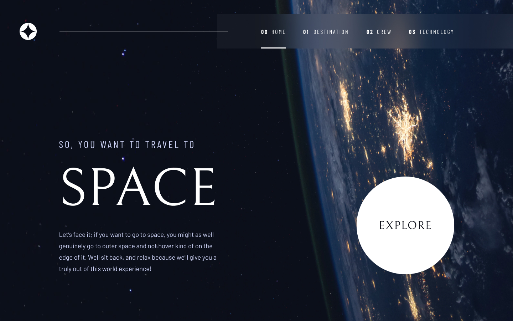

# Space Tourism

This project was generated with [CRA](https://create-react-app.dev/) version 18.1.0.

## Libraries used:

- Framer Motion
- Styled-components
- React Router DOM

## Steps to clone this repository.

1.  Open up the terminal, and enter this command: `git clone https://github.com/Abdulshakur24/space-tourism`
2.  Move to space-tourism directory by this command: `cd space-tourism`
3.  Install the necessary dependencies with this command: `yarn install`
4.  Finally run the server with this command: `yarn start`

_Note: React was installed with_ [YARN Manager](https://classic.yarnpkg.com/lang/en/)

###### Enjoy!
